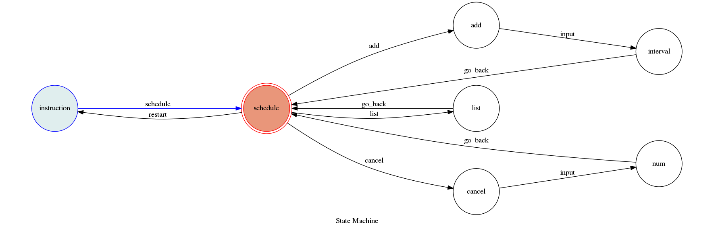
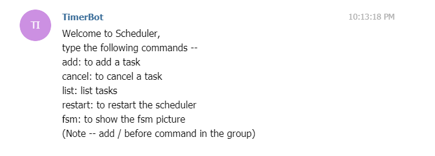
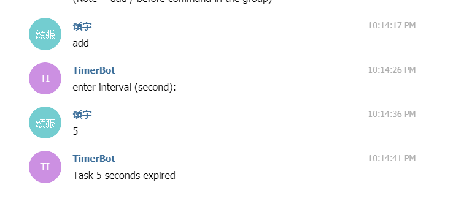
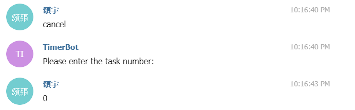
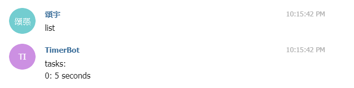
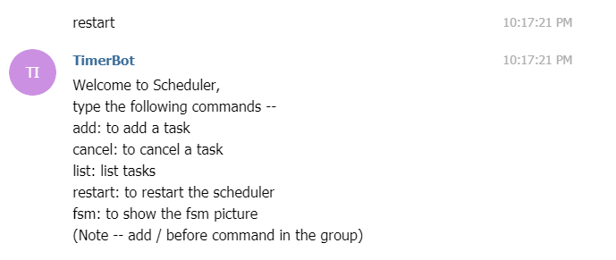
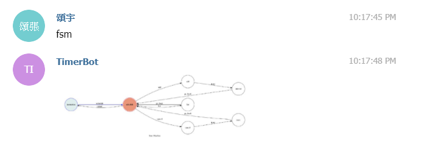

# TimerBot
這是一個專門計時的聊天機器人

## 設計理念
原本想設計一個可以幫忙規劃時間的小秘書，但是因為住院所以時間不夠

所以只做好了設定時間重複提醒的功能

但其實這著功能也蠻好玩的

玩法1：屁孩玩法，把機器人加到一個群聊，然後設定很多個task，人家就會吵死

玩法2：提醒功能，當跟朋友聊天聊太久時會提醒你

玩法3：工作時間規劃，打程式時適時提醒你準備星席、該休息了

## 技術
為了達到可以同步處理不同使用者的訊息，我使用了Actor Model

在python中使用pykka這個library

然後我也自己用threading.Timer搭配heapq實做了一個Scheduler

此外可以為不同使用者顯示當前的fsm

## 未來展望
結合資料庫 MongoDB

可以結合日歷設定行程

安排行程建議

行程分類

檢討行程規劃

自訂排班方式

## Setup

### Prerequisite
* Python 3
* graphviz

#### Install Dependency
```sh
pip install -r requirements.txt
```

* pygraphviz (For visualizing Finite State Machine)
    * [Setup pygraphviz on Ubuntu](http://www.jianshu.com/p/a3da7ecc5303)

### Secret Data
建立一個叫做 config.py 的檔案在主目錄下，內容為
```
TELEGRAM_API_TOKEN = 'YOUR_TELEGRAM_API_TOKEN'
TELEGRAM_WEBHOOK_URL = 'YOUR_TELEGRAM_WEBHOOK_URL'
```	
`TELEGRAM_API_TOKEN` and `TELEGRAM_WEBHOOK_URL` in .py **MUST** be set to proper values.
Otherwise, you might not be able to run your code.

### Run Locally
You can either setup https server or using `ngrok` as a proxy.

**`ngrok` would be used in the following instruction**

```sh
ngrok http 5000
```

After that, `ngrok` would generate a https URL.

You should set `TELEGRAM_WEBHOOK_URL` (in config.py) to `https://your-https-URL/hook`.

#### Run the sever
```sh
python3 app.py
```

### Run on my Server

Find @TimerTaskBot on the Telegram and you can run it if my server is opened. I have a server that can run for a long time.

## Finite State Machine


## Usage


add: to add a task

enter interval (second):

5 (for example)



cancel: to cancel a task

Please enter the task number:

0 (for example, enter the task's id)



list: list tasks




restart: to restart the scheduler



fsm: to show the fsm picture



## Author
[張頌宇](https://github.com/timcsy)
成大資訊系108級 F74046462
